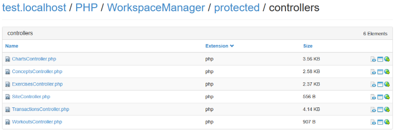

# CAutoIndex

## Explorador de archivos

CAutoIndex funciona de manera similar a la extensión [mod_autoindex](http://httpd.apache.org/docs/2.2/mod/mod_autoindex.html) de Apache con el agregado de mejor interfaz y funcionalidades extra.

Según la ubicación dada por la URL, genera automáticamente una lista de archivos y carpetas navegables con opciones de visualización y detalles.

Es muy fácil de usar e instalar.

**Requiere de PHP 5.3+**

## Características

- Navegación asyncrona con AJAX.
- Sincronización con botones atrás/adelante del navegador.
- Visualización de detalles del directorio y archivos.
- Control del orden de visualización.
- Visualización del código de fuente de archivos.
- Visualización de imágenes.
- Vista rápida de archivos en iframe.
- Auto-indexación de directorios por medio de la URL.
- No es invasivo, funciona en paralelo sin intervenciones de archivos o carpetas.
- Optimizado para dispositivos móviles.

## Instalación

La instalación es muy sencilla y solamente requiere de 3 pasos:

- Descargar.
- Descomprimir.
- Mover la carpeta **CAutoIndex** y el archivo **.htaccess** a la ubicación que se desee explorar.

Eso es todo, al ingresar a la ubicación por medio de un servidor web se verá el nuevo explorador de ficheros CAutoIndex.

# Opciones

Las opciones se configuran en el archivo `/config/options.php`

| Nombre | Descripción |
| -- | -- |
| rootName | Asigna un nombre al directorio raíz. Si el valor está vacío toma el nombre del subdirectorio o en caso de no haber subdirectorio, utiliza el nombre del dominio. |
| disableAnimations | Si esta variable es `true` se desactivaran los efectos de animación de la aplicación. |
| ignoreElements | Lista de rutas de archivos o directorios que se desea que el sistema ignore al crear los índices. |
| fileSystemEncoding | Codificación por defecto que utiliza el sistema de archivos. En sistemas Windows se recomienda usar Windows-1252. Para ver la lista completa de codificaciones disponibles se puede usar la función PHP [mb_list_encodings()](http://php.net/manual/es/function.mb-list-encodings.php). |
| language | Indica el idioma del sistema. Se debe comprobar que el idioma exista en la configuración de `translations`. |
| translations | Array asociativo de traducciones. En el primer nivel se divide en idiomas y a su vez cada idioma en mensajes de traducción. Es obligatorio que cada idioma cuente con todos los mensajes de traducción asignados. |

## Agradecimientos

No lo podría haber hecho sin estos grandes recursos de código abierto.
Muchas gracias a:

- [Silex](http://silex.sensiolabs.org/).
- [jQuery](http://jquery.com/).
- [Bootstrap](http://getbootstrap.com/).
- [fancyBox](http://fancyapps.com/fancybox/).
- [SyntaxHighlighter](http://alexgorbatchev.com/SyntaxHighlighter/).
- [Pines Notify](http://pinesframework.org/pnotify/).
- [History.js](https://github.com/browserstate/history.js).
- [FatCow Icons](http://www.fatcow.com/free-icons).

## Licencia

CAutoindex es distribuido bajo licencia GPL. (http://www.gnu.org/licenses/gpl.txt)